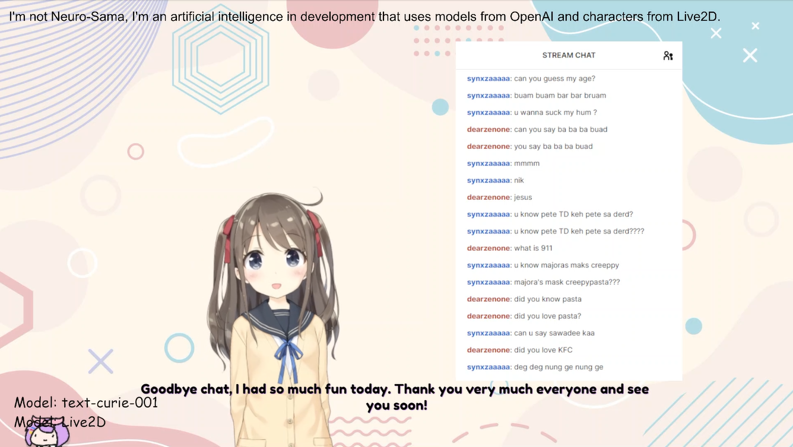

> **_NOTE:_**  This repository is being moved to the Public Archive because it may become inactive after Apr 4, 2023 and/or is deprecated.

> **_NOTE:_**  It's been so long, I don't think this project is going to continue. And I don't guarantee that there will be a new project in a new repository with new technology anytime soon, but I think this project is very interesting. Thank you for your support, with ❤️ to the community.

# AI VTuber by Ponlponl123 & InsanityLabs 
this project is in development...

**Project Check List**
- [x]  This project is also compatible with NodeJS v16.17.1.

- [x]  Better TTS.
- [x]  OpenAI ChatGPT.
- [ ]  This project is outdated.

## Installation
**See Install Doc**
[Install Document](https://github.com/InsanityLabs/AIVTuber/blob/main/INSTALL.md)

## License
- **Character Model by Live2D**

    [Live2D Free Material License](https://www.live2d.jp/en/terms/live2d-free-material-license-agreement/)
- **AI Language Model by OpenAI**

    [OpenAI Node License](https://github.com/openai/openai-node/blob/master/LICENSE)

## VTube Studio API
I'm using the [VTS Desktop Audio Plugin by Lua Lucky](https://lualucky.itch.io/vts-desktop-audio-plugin) to capture the sound and send it as Parameters so that the sides of the character can move.

DenchiSoft VTubeStudio [Plugins list](https://github.com/DenchiSoft/VTubeStudio)

https://lualucky.itch.io/vts-desktop-audio-plugin

## node main.js
Finally, if everything goes as expected. You will now be able to run `node main.js` successfully. 
